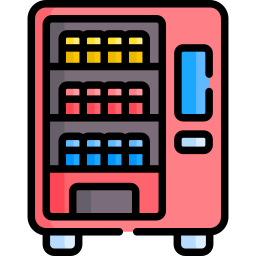

# Vending-Machine

## Vending Machine Project

> 한국공학대학교 소프트웨어전공 전산학기초 과제  
> 개발기간: 2023-05-02 ~ 진행중

## 프로젝트 소개

본 프로젝트는 Python을 활용하여 한국공학대 E동 5층에 위치한 음료 자판기를 최대한 비슷하게 동작하도록 구현하는 것을 목표로 한다.  
이 프로그램은 사용자가 선택한 음료를 구별하여 확인하고, 해당 음료의 가격을 계산 후 사용자가 투입한 금액을 비교하여 거스름 돈을 반환하는 기능을 포함한다.

## Stack

